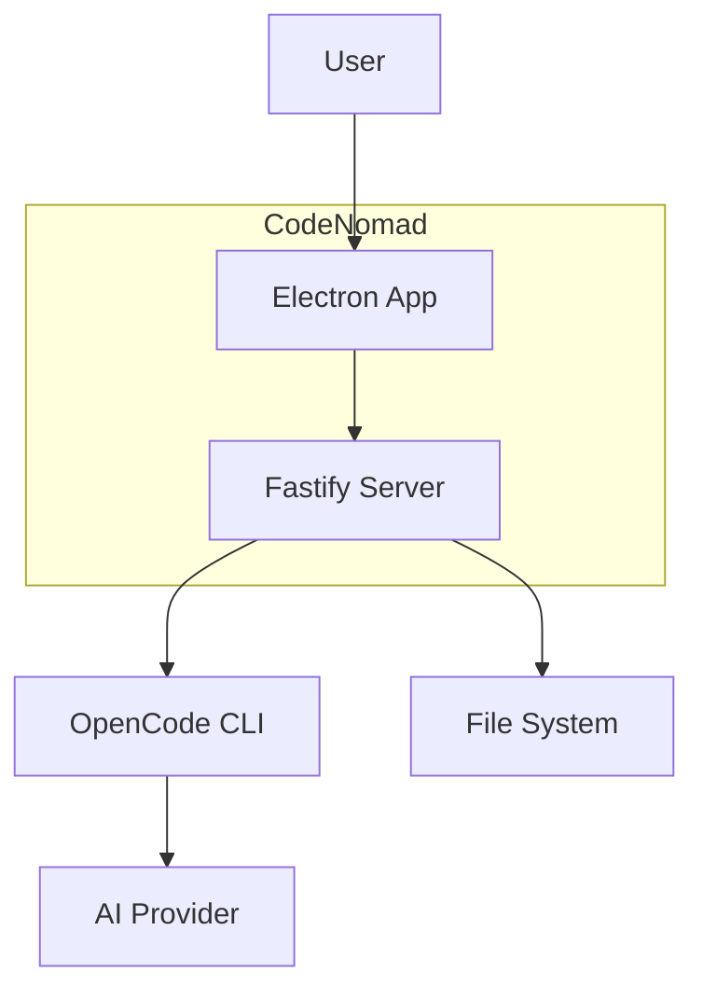

# CodeNomad Productionization Plan

**Version**: 1.0  
**Date**: February 4, 2026  
**Status**: Detailed Roadmap & Strategy Document  
**Target Audience**: Software Engineers

---

## Executive Summary

CodeNomad is currently a **functional MVP** (v0.9.5) with working multi-instance OpenCode workspace management, desktop applications (Electron + experimental Tauri), and a web server deployment option. The project demonstrates strong architectural foundations but requires significant work to become production-ready.

**Current State**: Beta-quality prototype with:
- ✅ Core functionality working
- ✅ Multi-platform releases (macOS, Windows, Linux)
- ✅ Automated CI/CD for builds
- ⚠️ Minimal testing infrastructure (2 test files only)
- ⚠️ No code quality tooling (linting, formatting)
- ⚠️ Security vulnerabilities in dependencies
- ⚠️ Limited observability and monitoring
- ⚠️ No comprehensive documentation for contributors

**Recommendation**: Treat current codebase as a **working prototype**. Build production version iteratively while leveraging existing architecture and user-validated features.

---

## 1. Current State Assessment

### 1.1 What's Working Well

**Architecture & Design**:
- Clean monorepo structure with proper separation of concerns
- SolidJS for reactive, high-performance UI
- Fastify server with efficient HTTP/SSE streaming
- Multi-deployment targets (Electron, Tauri, Web)
- Clear state management with SolidJS stores

**Features & Functionality**:
- Multi-instance workspace management
- Session/message streaming with real-time updates
- File system browsing and search
- Background process management
- Multi-language i18n support
- Command palette for keyboard-first workflow

**DevOps & Release**:
- GitHub Actions CI/CD for automated releases
- Cross-platform binary builds (macOS/Windows/Linux)
- NPM publishing workflow
- Version management across workspaces

### 1.2 Critical Gaps for Production

| Category | Gap | Risk Level | Impact |
|----------|-----|------------|--------|
| **Testing** | Only 2 test files in entire codebase | 🔴 **CRITICAL** | No confidence in changes, high regression risk |
| **Code Quality** | No linting (ESLint), no formatting (Prettier) | 🔴 **CRITICAL** | Inconsistent code, hard to maintain |
| **Security** | Multiple dependency vulnerabilities (moderate-high) | 🔴 **CRITICAL** | Potential security exploits |
| **Error Handling** | Basic error handling, no structured logging for production | 🟡 **HIGH** | Poor debuggability in production |
| **Monitoring** | No telemetry, metrics, or health checks | 🟡 **HIGH** | Cannot diagnose production issues |
| **Documentation** | Missing: API docs, contribution guide, architecture diagrams | 🟡 **HIGH** | Hard for new contributors |
| **Performance** | No benchmarks or load testing | 🟢 **MEDIUM** | Unknown scalability limits |
| **Database** | File-based storage with no migration strategy | 🟢 **MEDIUM** | Difficult to upgrade data schemas |
| **Observability** | No error tracking (Sentry), analytics, or usage metrics | 🟢 **MEDIUM** | Cannot measure success or failures |

### 1.3 Technical Debt Inventory

**Immediate Concerns**:
1. **Dependency vulnerabilities**: `@fastify/reply-from` (moderate), `electron-builder` dependencies (high), `diff` (low)
2. **Missing test infrastructure**: No test runner, no CI test jobs
3. **No code standards enforcement**: Developers can commit inconsistent code
4. **Dev/prod parity**: Different behaviors between development and production builds

**Medium-term Concerns**:
1. Hardcoded configuration values scattered across files
2. No environment-based configuration management
3. Limited error boundaries in UI components
4. No structured logging with correlation IDs
5. Manual version bumping process

**Long-term Architecture Considerations**:
1. File-based storage won't scale to thousands of sessions
2. No plugin/extension architecture for customization
3. Single-process architecture limits scalability
4. No offline-first capabilities

---

## 2. Testing Strategy & Infrastructure

### 2.1 Testing Philosophy

**Pyramid Approach**:
```
    /\
   /E2E\           ← 10% - Critical user journeys
  /──────\
 /  INT   \        ← 30% - API contracts, SSE flows, IPC
/──────────\
/   UNIT    \      ← 60% - Business logic, utilities, stores
──────────────
```

**Testing Principles**:
- **Test behavior, not implementation**: Focus on user/API contracts
- **Fast feedback loops**: Unit tests run in <5s, integration in <30s
- **Deterministic**: No flaky tests; use proper mocking/stubbing
- **Maintainable**: Tests should be easier to update than rewrite

### 2.2 Unit Testing Setup

**Stack**:
- **Framework**: Vitest (fast, Vite-native, ESM-first)
- **Assertion Library**: Built-in Vitest assertions
- **Mocking**: Vitest mocks + MSW for HTTP
- **Coverage**: c8 for code coverage (target: 70% for critical paths)

**What to Test**:
- State management stores (sessions, instances, preferences)
- Utilities (formatting, parsing, validation)
- Business logic (session lifecycle, message processing)
- API clients and SDK wrappers
- IPC handlers (main process)

**Example Test Structure**:
```typescript
// packages/server/src/__tests__/workspaces/manager.test.ts
describe('WorkspaceManager', () => {
  describe('spawn()', () => {
    it('should spawn opencode process with correct args')
    it('should extract port from stdout')
    it('should timeout after 10s if no port detected')
    it('should emit "ready" event when process starts')
  })
})
```

**Implementation Plan**:
1. Add Vitest to root `package.json` and all workspace packages
2. Create `vitest.config.ts` per package with workspace-aware paths
3. Add `npm run test` and `npm run test:watch` scripts
4. Write tests for **critical paths first**:
   - Workspace spawning and lifecycle
   - Session store mutations
   - Message streaming and parsing
   - File system search cache
5. Add coverage reporting: `npm run test:coverage`
6. Enforce minimum coverage in CI (60% to start)

### 2.3 Integration Testing

**What to Test**:
- HTTP API endpoints (Fastify routes)
- SSE event streaming end-to-end
- IPC communication (main ↔ renderer)
- SDK client interactions with mock OpenCode server
- File system operations
- Process spawning and cleanup

**Tools**:
- Vitest for test orchestration
- MSW (Mock Service Worker) for HTTP mocking
- `@fastify/testing` for route testing
- `node:test` for Node.js native process tests

**Example Integration Test**:
```typescript
// packages/server/src/__tests__/integration/workspace-api.test.ts
describe('Workspace API', () => {
  it('POST /workspaces should spawn process and return descriptor', async () => {
    const response = await app.inject({
      method: 'POST',
      url: '/workspaces',
      payload: { path: '/tmp/test-project' }
    })
    expect(response.statusCode).toBe(201)
    expect(response.json()).toMatchObject({
      id: expect.any(String),
      path: '/tmp/test-project',
      status: 'ready'
    })
  })
})
```

### 2.4 End-to-End (E2E) Testing

**Stack**:
- **Framework**: Playwright (cross-browser, Electron support)
- **Scope**: Critical user flows only (not exhaustive)

**Critical Flows to Test**:
1. Launch app → Select folder → Create session → Send message → Receive response
2. Multi-instance: Open 2 workspaces → Switch tabs → Verify isolation
3. Session lifecycle: Create → Resume → Close
4. Error handling: Invalid folder → Network failure → Process crash
5. File operations: Browse filesystem → Attach file

**E2E Test Strategy**:
- Run in CI on **major release branches** only (too slow for every PR)
- Use headless mode in CI, headed locally for debugging
- Record videos on failure
- Target: 5-10 critical tests, <5 min total runtime

### 2.5 Test Coverage Goals

| Package | Target Coverage | Priority Tests |
|---------|----------------|----------------|
| **server** | 70% | Workspace manager, routes, auth |
| **ui** | 60% | Stores, message rendering, tool call handlers |
| **electron-app** | 50% | IPC handlers, process management |

**Coverage Tracking**:
- Configure Codecov or Coveralls in CI
- Block PRs if coverage drops >2%
- Display coverage badges in README.md

### 2.6 CI/CD Testing Integration

**Test Jobs in GitHub Actions**:
```yaml
# .github/workflows/test.yml
name: Test Suite

on: [push, pull_request]

jobs:
  unit-tests:
    runs-on: ubuntu-latest
    steps:
      - uses: actions/checkout@v4
      - uses: actions/setup-node@v4
        with:
          node-version: 20
      - run: npm ci
      - run: npm run test -- --coverage
      - uses: codecov/codecov-action@v4
  
  integration-tests:
    runs-on: ubuntu-latest
    steps:
      - run: npm run test:integration
  
  e2e-tests:
    strategy:
      matrix:
        os: [ubuntu-latest, macos-latest, windows-latest]
    runs-on: ${{ matrix.os }}
    steps:
      - run: npm run test:e2e
```

**Test Execution Strategy**:
- **Unit tests**: Run on every commit (fast feedback)
- **Integration tests**: Run on every PR + main branch
- **E2E tests**: Run on release branches + nightly builds
- **Performance tests**: Run on release candidates

---

## 3. Code Quality & Standards

### 3.1 Linting & Formatting

**ESLint Setup**:
```json
{
  "extends": [
    "eslint:recommended",
    "plugin:@typescript-eslint/recommended",
    "plugin:solid/typescript",
    "prettier"
  ],
  "rules": {
    "no-console": "warn",
    "no-unused-vars": "off",
    "@typescript-eslint/no-unused-vars": ["error", { "argsIgnorePattern": "^_" }],
    "@typescript-eslint/explicit-function-return-type": "off",
    "@typescript-eslint/no-explicit-any": "warn"
  }
}
```

**Prettier Configuration**:
```json
{
  "semi": true,
  "singleQuote": true,
  "tabWidth": 2,
  "printWidth": 100,
  "trailingComma": "es5"
}
```

**Implementation Steps**:
1. Install ESLint + TypeScript + SolidJS plugins
2. Install Prettier + eslint-config-prettier
3. Add `.eslintrc.json` and `.prettierrc` to root
4. Add npm scripts: `lint`, `lint:fix`, `format`
5. Configure pre-commit hooks with Husky + lint-staged
6. Fix existing linting errors incrementally (don't block all work)
7. Add ESLint job to CI

### 3.2 Pre-commit Hooks

**Husky + lint-staged**:
```json
// package.json
{
  "lint-staged": {
    "*.{ts,tsx}": [
      "eslint --fix",
      "prettier --write"
    ],
    "*.{json,md,css}": [
      "prettier --write"
    ]
  }
}
```

**Pre-commit workflow**:
1. Developer commits code
2. Husky triggers lint-staged
3. ESLint checks + auto-fixes TypeScript files
4. Prettier formats all files
5. If any errors remain → commit fails
6. Developer fixes issues → re-commits

### 3.3 Type Safety Enhancements

**Strict TypeScript Configuration**:
```json
{
  "compilerOptions": {
    "strict": true,
    "noUncheckedIndexedAccess": true,
    "noImplicitOverride": true,
    "noFallthroughCasesInSwitch": true,
    "forceConsistentCasingInFileNames": true
  }
}
```

**Gradual Adoption Strategy**:
- Enable strict mode in **new files only** initially
- Add `// @ts-check` to existing JavaScript files
- Incrementally fix type errors in high-impact modules
- Target: 100% strict compliance by v1.0 release

### 3.4 Code Review Standards

**PR Requirements**:
- ✅ All tests passing
- ✅ ESLint + Prettier checks passing
- ✅ Code coverage maintained or improved
- ✅ At least 1 approving review
- ✅ No merge conflicts
- ✅ Semantic commit messages (Conventional Commits)

**Review Checklist Template**:
```markdown
## Code Review Checklist
- [ ] Code follows style guide
- [ ] Tests added for new functionality
- [ ] Error handling is comprehensive
- [ ] No hardcoded secrets or credentials
- [ ] Documentation updated (if API changed)
- [ ] Breaking changes flagged and documented
```

---

## 4. Security Hardening

### 4.1 Dependency Management

**Immediate Actions**:
1. **Update vulnerable dependencies**:
   ```bash
   npm audit fix --force
   # Review breaking changes carefully
   ```
   - `@fastify/reply-from`: Upgrade to v12.6.0+
   - `electron-builder`: Upgrade to v26.7.0+
   - `diff`: Upgrade to v4.0.4+

2. **Enable Dependabot**:
   ```yaml
   # .github/dependabot.yml
   version: 2
   updates:
     - package-ecosystem: "npm"
       directory: "/"
       schedule:
         interval: "weekly"
       open-pull-requests-limit: 10
   ```

3. **Lock file integrity**:
   - Commit `package-lock.json` to version control
   - Use `npm ci` in CI (not `npm install`)
   - Verify checksums in CI

**Ongoing Practices**:
- Weekly dependency audits
- Automated security scanning (Snyk or GitHub Advanced Security)
- Pin direct dependencies to exact versions in production
- Regular major version upgrades (quarterly)

### 4.2 Secrets Management

**Current Issues**:
- Hardcoded `CODENOMAD_SERVER_PASSWORD=codenomad-dev` in scripts
- No environment-based configuration

**Solutions**:
1. **Environment Variables**:
   ```typescript
   // packages/server/src/config.ts
   import { z } from 'zod';
   
   const envSchema = z.object({
     NODE_ENV: z.enum(['development', 'production', 'test']),
     CODENOMAD_SERVER_PASSWORD: z.string().min(12),
     PORT: z.coerce.number().default(3000),
     LOG_LEVEL: z.enum(['debug', 'info', 'warn', 'error']).default('info'),
   });
   
   export const config = envSchema.parse(process.env);
   ```

2. **Secure Defaults**:
   - Development: Use `.env.development` (gitignored)
   - Production: Require explicit environment variables
   - Never commit `.env` files

3. **Electron Secure Storage**:
   - Use `electron-store` with encryption for sensitive data
   - Store API tokens in OS keychain (macOS/Windows/Linux)

### 4.3 Application Security

**CSP (Content Security Policy)**:
```typescript
// packages/server/src/server/http-server.ts
app.addHook('onRequest', async (request, reply) => {
  reply.header('Content-Security-Policy', 
    "default-src 'self'; script-src 'self' 'unsafe-inline'; style-src 'self' 'unsafe-inline'"
  );
});
```

**Input Validation**:
- Use Zod schemas for all API endpoints
- Sanitize file paths to prevent directory traversal
- Validate all IPC messages in Electron

**Electron Security Checklist**:
- ✅ Context isolation enabled
- ✅ Node integration disabled in renderer
- ✅ Remote module disabled
- ⚠️ Enable `webSecurity` in production
- ⚠️ Implement code signing for macOS/Windows

### 4.4 Authentication & Authorization

**Current State**: Basic password authentication for server mode

**Production Requirements**:
1. **Session Management**:
   - HTTP-only cookies
   - CSRF protection
   - Session timeout (30 min idle)
   - Refresh token rotation

2. **OAuth Integration** (optional for v1.0):
   - GitHub OAuth
   - Google OAuth (already has dependency)
   - SSO for enterprise

3. **API Key Management**:
   - Generate API keys for programmatic access
   - Key rotation mechanism
   - Scope-based permissions

---

## 5. Observability & Monitoring

### 5.1 Structured Logging

**Current State**: Pino logger exists but not consistently used

**Improvements**:
```typescript
// packages/server/src/lib/logger.ts
import pino from 'pino';

export const logger = pino({
  level: config.LOG_LEVEL,
  transport: config.NODE_ENV === 'development' ? {
    target: 'pino-pretty',
    options: { colorize: true }
  } : undefined,
  formatters: {
    level: (label) => ({ level: label }),
  },
  timestamp: pino.stdTimeFunctions.isoTime,
});

// Add correlation IDs for request tracking
export const withRequestId = (requestId: string) => 
  logger.child({ requestId });
```

**Logging Standards**:
- **Levels**: `debug` (dev only), `info` (normal ops), `warn` (recoverable errors), `error` (requires attention)
- **Context**: Always include `requestId`, `userId`, `workspaceId` where relevant
- **Secrets**: Never log passwords, tokens, or PII
- **Performance**: Log request duration, memory usage for heavy operations

### 5.2 Error Tracking

**Tool**: Sentry for centralized error tracking

**Implementation**:
```typescript
// packages/server/src/index.ts
import * as Sentry from '@sentry/node';

if (config.NODE_ENV === 'production') {
  Sentry.init({
    dsn: config.SENTRY_DSN,
    environment: config.NODE_ENV,
    tracesSampleRate: 0.1,
  });
}

// Fastify plugin
app.setErrorHandler((error, request, reply) => {
  Sentry.captureException(error, {
    tags: { path: request.url, method: request.method },
  });
  logger.error({ err: error }, 'Request error');
  reply.status(500).send({ error: 'Internal Server Error' });
});
```

**Electron Error Tracking**:
```typescript
// packages/electron-app/electron/main/main.ts
import { init as sentryInit } from '@sentry/electron/main';

sentryInit({
  dsn: process.env.SENTRY_DSN,
  environment: app.isPackaged ? 'production' : 'development',
});
```

### 5.3 Performance Monitoring

**Metrics to Track**:
- **Request duration**: p50, p95, p99 for all HTTP endpoints
- **Memory usage**: Heap size, RSS per workspace instance
- **Process lifecycle**: Spawn time, crash rate, restart count
- **UI rendering**: Time to interactive, largest contentful paint
- **SSE latency**: Time from message sent to UI update

**Tools**:
- **APM**: Sentry Performance or Datadog
- **Custom metrics**: Prometheus + Grafana (for self-hosted deployments)
- **Frontend**: Web Vitals for SolidJS app

### 5.4 Health Checks & Status Endpoints

```typescript
// packages/server/src/server/routes/health.ts
app.get('/health', async () => ({
  status: 'ok',
  version: '0.9.5',
  uptime: process.uptime(),
  workspaces: workspaceManager.getActiveCount(),
}));

app.get('/health/ready', async () => {
  // Check dependencies: file system, ports available
  const ready = await checkSystemReady();
  return { ready };
});
```

**Monitoring Dashboards**:
- Active workspaces over time
- Request error rate
- Average session duration
- Top error types
- Resource usage per OS/platform

---

## 6. CI/CD Enhancements

### 6.1 Current Pipeline Analysis

**Existing Workflows**:
1. `release.yml` - Builds binaries on push to main
2. `reusable-release.yml` - Multi-platform builds
3. `dev-release.yml` - NPM dev version publishing
4. `manual-npm-publish.yml` - Manual NPM releases

**What's Missing**:
- ❌ No testing in CI
- ❌ No linting/type checking
- ❌ No security scanning
- ❌ No artifact validation
- ❌ No automated changelog generation

### 6.2 Enhanced CI Pipeline

**Proposed Workflow Structure**:
```
┌─────────────┐
│ PR Created  │
└─────┬───────┘
      │
      ├─────► Lint & Format Check
      ├─────► TypeScript Type Check
      ├─────► Unit Tests (all packages)
      ├─────► Integration Tests
      ├─────► Security Scan (npm audit)
      ├─────► Build (all packages)
      └─────► Code Coverage Report
              │
              ▼
         ┌─────────┐
         │ PR Pass │
         └─────┬───┘
               │
          Merge to main
               │
               ▼
         ┌─────────────┐
         │ Post-merge  │
         └─────┬───────┘
               │
               ├─────► E2E Tests (critical flows)
               ├─────► Build Binaries (all platforms)
               ├─────► Sign Binaries (macOS/Windows)
               ├─────► Upload to GitHub Releases
               ├─────► Publish NPM Package (@dev tag)
               └─────► Update Changelog
```

**New Workflow Files**:

1. **`.github/workflows/ci.yml`** - PR validation
   ```yaml
   name: CI
   on: [pull_request]
   jobs:
     lint:
       runs-on: ubuntu-latest
       steps:
         - run: npm run lint
     
     typecheck:
       runs-on: ubuntu-latest
       steps:
         - run: npm run typecheck
     
     test:
       runs-on: ubuntu-latest
       steps:
         - run: npm run test -- --coverage
         - uses: codecov/codecov-action@v4
   ```

2. **`.github/workflows/security.yml`** - Weekly scans
   ```yaml
   name: Security Scan
   on:
     schedule:
       - cron: '0 0 * * 1' # Monday at midnight
   jobs:
     scan:
       runs-on: ubuntu-latest
       steps:
         - run: npm audit --audit-level=moderate
         - uses: snyk/actions/node@master
   ```

3. **`.github/workflows/release-stable.yml`** - Stable releases
   ```yaml
   name: Release Stable
   on:
     push:
       tags:
         - 'v*'
   jobs:
     release:
       uses: ./.github/workflows/reusable-release.yml
       with:
         dist_tag: latest
         sign_binaries: true
   ```

### 6.3 Artifact Management

**Binary Signing**:
- **macOS**: Apple Developer ID signing + notarization
- **Windows**: Code signing certificate (EV cert recommended)
- **Linux**: GPG signing for packages

**Artifact Storage**:
- GitHub Releases for official builds
- S3 bucket for nightly/dev builds (retention: 30 days)
- NPM registry for `@neuralnomads/codenomad` package

**Version Strategy**:
- **Stable releases**: `v1.0.0`, `v1.1.0` (semantic versioning)
- **Dev releases**: `v1.0.0-dev.123` (commit SHA)
- **Nightly builds**: `v1.0.0-nightly.20260204`

### 6.4 Automated Changelog

**Tool**: `conventional-changelog` or `release-please`

**Workflow**:
```yaml
# .github/workflows/changelog.yml
name: Update Changelog
on:
  push:
    branches: [main]
jobs:
  changelog:
    runs-on: ubuntu-latest
    steps:
      - uses: actions/checkout@v4
        with:
          fetch-depth: 0
      - run: npx conventional-changelog-cli -p angular -i CHANGELOG.md -s
      - uses: peter-evans/create-pull-request@v5
        with:
          commit-message: "chore: update CHANGELOG.md"
          title: "chore: update changelog"
```

**Commit Message Convention**:
```
feat: add session export functionality
fix: resolve memory leak in message streaming
chore: update dependencies
docs: add API documentation
test: add unit tests for workspace manager
```

---

## 7. Deployment & Infrastructure

### 7.1 Deployment Targets

**Current Deployment Options**:
1. **Desktop Apps** (Electron/Tauri) - Download from GitHub Releases
2. **NPM Package** - `npx @neuralnomads/codenomad --launch`
3. **Web Server** - Self-hosted on any Node.js platform

**Production Deployment Recommendations**:

#### 7.1.1 Desktop Distribution
- **Auto-update**: Implement Electron auto-updater
- **Update channels**: Stable, Beta, Nightly
- **Crash reporting**: Integrated Sentry
- **Telemetry**: Opt-in usage analytics

#### 7.1.2 Server Deployment (Self-hosted)
**Docker Container**:
```dockerfile
FROM node:20-alpine
WORKDIR /app
COPY package*.json ./
RUN npm ci --production
COPY . .
EXPOSE 3000
CMD ["npm", "start"]
```

**Docker Compose (with reverse proxy)**:
```yaml
version: '3.8'
services:
  codenomad:
    image: codenomad:latest
    environment:
      - NODE_ENV=production
      - CODENOMAD_SERVER_PASSWORD=${PASSWORD}
    volumes:
      - ./workspaces:/app/workspaces
    ports:
      - "3000:3000"
  
  nginx:
    image: nginx:alpine
    ports:
      - "80:80"
      - "443:443"
    volumes:
      - ./nginx.conf:/etc/nginx/nginx.conf
      - ./ssl:/etc/nginx/ssl
```

**Deployment Platforms**:
- **AWS**: EC2 + ECS/Fargate, ALB for load balancing
- **GCP**: Cloud Run (serverless), GKE for Kubernetes
- **Azure**: App Service, AKS
- **Self-hosted**: Docker Compose on any VPS

#### 7.1.3 Cloud-Hosted SaaS (Future)
**Requirements for SaaS offering**:
- Multi-tenancy support
- Workspace isolation and resource limits
- Database migration from file-based to PostgreSQL
- Redis for session management
- S3/GCS for file attachments
- CDN for static assets
- Horizontal scaling with Kubernetes

### 7.2 Environment Configuration

**Configuration Layers**:
1. **Defaults** (hardcoded in code)
2. **Config file** (`config.json`, `config.production.json`)
3. **Environment variables** (override config file)
4. **CLI flags** (override environment)

**Example Configuration**:
```typescript
// packages/server/src/config/index.ts
import { z } from 'zod';

const configSchema = z.object({
  server: z.object({
    port: z.number().default(3000),
    host: z.string().default('127.0.0.1'),
    cors: z.boolean().default(false),
  }),
  workspace: z.object({
    maxInstances: z.number().default(10),
    spawnTimeout: z.number().default(10000),
  }),
  logging: z.object({
    level: z.enum(['debug', 'info', 'warn', 'error']).default('info'),
    pretty: z.boolean().default(false),
  }),
  security: z.object({
    passwordRequired: z.boolean().default(true),
    sessionTimeout: z.number().default(1800),
  }),
});

export const loadConfig = () => {
  // Load from file, merge with env, validate
};
```

### 7.3 Backup & Data Management

**Current State**: File-based storage in `.codenomad` directory

**Production Requirements**:
1. **Automatic Backups**:
   - Daily snapshots of session data
   - Retain last 7 days locally
   - Weekly remote backups (S3/GCS)

2. **Data Migration Strategy**:
   - Version schema in storage files
   - Migration scripts for breaking changes
   - Rollback capability

3. **Export/Import**:
   - Export workspace to ZIP
   - Import workspace from backup
   - Bulk session export to JSON/Markdown

### 7.4 Scaling Considerations

**Current Limitations**:
- Single Node.js process per server instance
- File-based storage doesn't scale to 1000s of sessions
- No distributed architecture

**Scaling Strategy** (for SaaS or large deployments):
1. **Horizontal Scaling**:
   - Load balancer (Nginx, HAProxy)
   - Session affinity (sticky sessions)
   - Redis for shared session state

2. **Database Migration**:
   - PostgreSQL for session metadata
   - S3/object storage for message content
   - Elasticsearch for full-text search

3. **Resource Management**:
   - CPU/memory limits per workspace
   - Queue system for workspace spawning (Bull/BullMQ)
   - Auto-scale workers based on load

---

## 8. Documentation & Developer Experience

### 8.1 Documentation Structure

**Proposed Structure**:
```
docs/
├── README.md                    # Overview, quick start
├── guides/
│   ├── getting-started.md       # Installation, first run
│   ├── architecture.md          # System design (exists)
│   ├── deployment.md            # Production deployment
│   └── contributing.md          # How to contribute
├── api/
│   ├── server-api.md            # HTTP/SSE API reference
│   ├── ipc-api.md               # Electron IPC reference
│   └── sdk-usage.md             # OpenCode SDK integration
├── development/
│   ├── setup.md                 # Dev environment setup
│   ├── testing.md               # Writing tests
│   ├── debugging.md             # Debugging tips
│   └── release-process.md       # How to cut a release
└── user-manual/
    ├── keyboard-shortcuts.md    # All shortcuts
    ├── troubleshooting.md       # Common issues
    └── faq.md                   # Frequently asked questions
```

**Priority Documents** (create first):
1. **CONTRIBUTING.md** - How to contribute, coding standards, PR process
2. **SECURITY.md** - Security policy, vulnerability disclosure
3. **CODE_OF_CONDUCT.md** - Community guidelines
4. **API.md** - Complete API reference with examples
5. **DEPLOYMENT.md** - Production deployment guide

### 8.2 API Documentation

**Tool**: Generate from code annotations

**Example**:
```typescript
/**
 * Create a new workspace instance
 * 
 * @route POST /workspaces
 * @param {string} path - Absolute path to project directory
 * @param {object} options - Spawn options
 * @param {number} options.port - Port to bind (0 for auto)
 * @returns {WorkspaceDescriptor} Created workspace
 * @throws {400} Invalid path
 * @throws {500} Failed to spawn process
 * 
 * @example
 * POST /workspaces
 * {
 *   "path": "/Users/dev/my-project",
 *   "options": { "port": 0 }
 * }
 * 
 * Response 201:
 * {
 *   "id": "ws-abc123",
 *   "path": "/Users/dev/my-project",
 *   "status": "ready",
 *   "port": 4096,
 *   "proxyPath": "/workspaces/ws-abc123/instance"
 * }
 */
app.post('/workspaces', async (request, reply) => {
  // implementation
});
```

**Generation**:
- Use JSDoc → Markdown conversion tool
- Publish to `docs/api/` directory
- Auto-generate on release

### 8.3 Onboarding for New Contributors

**Developer Setup Documentation**:
```markdown
# Development Setup

## Prerequisites
- Node.js 20+
- Git
- OpenCode CLI installed

## Steps
1. Clone the repository
   ```bash
   git clone https://github.com/NeuralNomadsAI/CodeNomad.git
   cd CodeNomad
   ```

2. Install dependencies
   ```bash
   npm install
   ```

3. Run tests to verify setup
   ```bash
   npm test
   ```

4. Start development server
   ```bash
   npm run dev
   ```

## Project Structure
- `packages/server/` - Backend (Fastify)
- `packages/ui/` - Frontend (SolidJS)
- `packages/electron-app/` - Desktop wrapper

## Making Changes
1. Create feature branch: `git checkout -b feat/my-feature`
2. Make changes, write tests
3. Run linter: `npm run lint`
4. Commit: `git commit -m "feat: add my feature"`
5. Push and open PR

## Common Tasks
- Run UI dev server: `npm run dev --workspace @codenomad/ui`
- Build all packages: `npm run build`
- Run specific tests: `npm test -- packages/server/src/workspaces`
```

### 8.4 Architecture Diagrams

**Tools**: Mermaid (embedded in Markdown)

**Key Diagrams Needed**:
1. **System Architecture** (high-level components)
2. **Data Flow** (request lifecycle)
3. **Deployment Architecture** (production setup)
4. **State Management** (stores and flows)

**Example**:


### 8.5 Changelog Maintenance

**Format**: Keep a Changelog (https://keepachangelog.com/)

**Structure**:
```markdown
# Changelog

All notable changes to CodeNomad will be documented in this file.

## [Unreleased]
### Added
- Session export to Markdown
### Changed
- Improved error messages for process spawn failures
### Fixed
- Memory leak in SSE connection handling

## [0.9.5] - 2026-01-15
### Added
- Multi-language i18n support
- Background process monitoring
### Fixed
- Crash on invalid folder selection
```

**Automation**: Use `conventional-changelog` to auto-generate from commit messages

---

## 9. Performance & Scalability

### 9.1 Performance Baseline

**Current State**: No performance benchmarks exist

**Recommended Benchmarks**:
1. **Startup Time**:
   - Electron app launch: <3s
   - First workspace spawn: <2s
   - UI time to interactive: <1s

2. **Runtime Performance**:
   - Message rendering: <16ms per message (60fps)
   - Handle 500+ messages without lag
   - Support 10 concurrent workspaces on typical hardware

3. **Memory Usage**:
   - Base app: <200MB
   - Per workspace: <100MB
   - Per session (1000 messages): <50MB

**Measurement Tools**:
- Lighthouse for UI performance
- Node.js profiler for server bottlenecks
- Electron DevTools for memory leaks

### 9.2 Optimization Strategy

**Phase 1: Measure & Document** (v1.0)
- Establish baselines
- Document known limitations
- Set performance budgets

**Phase 2: Low-Hanging Fruit** (v1.1)
- Lazy loading for heavy UI components
- Debounce expensive operations (search, file browsing)
- Connection pooling for HTTP clients

**Phase 3: Architectural Improvements** (v1.x)
- Virtual scrolling for message lists
- Web Workers for heavy parsing
- Database indexing for session queries

**Phase 4: Advanced Optimization** (v2.0+)
- Rust native modules for critical paths
- SQLite for local storage (instead of JSON files)
- Streaming message parsing with progressive rendering

### 9.3 Load Testing

**Scenarios**:
1. **Workspace Stress Test**: Spawn 50 workspaces simultaneously
2. **Message Volume Test**: Stream 10,000 messages to single session
3. **Concurrent Users** (server mode): 100 simultaneous clients
4. **File System Stress**: Browse directory with 100,000 files

**Tools**:
- k6 or Artillery for HTTP load testing
- Custom scripts for Electron stress testing

---

## 10. Migration from Prototype to Production

### 10.1 Refactoring Strategy

**Approach**: Incremental, not rewrite

**High-Priority Refactors**:
1. **Extract configuration management**:
   - Centralize all config into `config/` directory
   - Environment-aware loading

2. **Standardize error handling**:
   - Custom error classes with proper codes
   - Consistent error responses across API

3. **Separate concerns**:
   - Move business logic out of route handlers
   - Create service layer for reusability

4. **Improve type safety**:
   - Add Zod schemas for all API payloads
   - Strict null checks throughout codebase

**Low-Priority Refactors** (defer to v1.x):
- Migrate from file-based storage to SQLite
- Plugin architecture for extensibility
- Multi-process architecture for better isolation

### 10.2 Feature Parity Checklist

**Must-Have for v1.0**:
- ✅ All existing functionality works (multi-instance, sessions, messaging)
- ✅ Comprehensive test coverage (60%+ for critical paths)
- ✅ Production-grade error handling and logging
- ✅ Security hardening (dependency updates, CSP, input validation)
- ✅ Performance benchmarks met
- ✅ Documentation complete (API, deployment, contributing)

**Nice-to-Have for v1.0** (can defer):
- ❌ Plugin system
- ❌ Advanced search with filters
- ❌ Workspace templates
- ❌ Session collaboration/sharing

### 10.3 Backward Compatibility

**Data Migration**:
- Detect legacy session files on startup
- Auto-migrate to new format with backup
- Provide rollback if migration fails

**API Versioning** (if needed):
- Prefix routes with `/v1/`
- Support both v1 and v2 during transition
- Deprecation warnings for old APIs

---

## 11. Release Strategy

### 11.1 Version Roadmap

**v1.0.0 - Production Ready** (Target: Q2 2026)
- Core Features:
  - All existing functionality stable
  - Comprehensive testing infrastructure
  - Production-grade security & error handling
  - Complete documentation
  - Auto-update mechanism

**v1.1.0 - Performance & Polish** (Target: Q3 2026)
- Performance optimizations
- UI/UX improvements based on feedback
- Additional deployment options (Docker, Kubernetes)

**v1.2.0 - Advanced Features** (Target: Q4 2026)
- Session export/import
- Advanced search and filtering
- Workspace templates

**v2.0.0 - Extensibility** (Target: 2027)
- Plugin architecture
- Custom tool renderers
- Theme system
- Multi-user support

### 11.2 Release Checklist

**Pre-release**:
- [ ] All tests passing (unit, integration, E2E)
- [ ] Code coverage meets threshold (60%)
- [ ] No high/critical security vulnerabilities
- [ ] Documentation updated
- [ ] CHANGELOG.md updated
- [ ] Version bumped in all packages
- [ ] Binaries built for all platforms
- [ ] Binaries signed (macOS/Windows)

**Release**:
- [ ] Tag release in Git: `git tag v1.0.0`
- [ ] Push tag: `git push --tags`
- [ ] GitHub Actions builds and uploads artifacts
- [ ] NPM package published
- [ ] GitHub Release notes published

**Post-release**:
- [ ] Announce on social media/blog
- [ ] Update website with download links
- [ ] Monitor error reports (Sentry)
- [ ] Gather user feedback

### 11.3 Beta Testing Program

**Structure**:
- **Alpha**: Internal team testing (2 weeks)
- **Beta**: Public beta testing (4 weeks)
  - Recruit 50-100 beta testers
  - Provide feedback channels (Discord, GitHub Discussions)
  - Weekly updates and bug fixes
- **Release Candidate**: Final testing (1 week)
- **Stable Release**: Public availability

---

## 12. Implementation Phases

### Phase 1: Foundation (Weeks 1-2)
**Goal**: Establish quality infrastructure

**Tasks**:
1. Set up testing infrastructure (Vitest, Playwright)
2. Add ESLint + Prettier with pre-commit hooks
3. Create initial test suite for critical paths (30% coverage)
4. Fix dependency vulnerabilities
5. Set up Sentry error tracking
6. Create CONTRIBUTING.md and SECURITY.md

**Deliverables**:
- CI pipeline with tests + linting
- 30% test coverage
- Zero high/critical vulnerabilities
- Error tracking operational

---

### Phase 2: Testing & Quality (Weeks 3-4)
**Goal**: Comprehensive test coverage

**Tasks**:
1. Write unit tests for all stores and utilities (target: 70% coverage)
2. Add integration tests for API routes
3. Create E2E tests for 5 critical user flows
4. Implement code coverage reporting in CI
5. Add performance benchmarks
6. Fix flaky tests and improve test reliability

**Deliverables**:
- 60% overall code coverage
- E2E tests for critical flows
- Performance baseline documented

---

### Phase 3: Security & Hardening (Weeks 5-6)
**Goal**: Production-grade security

**Tasks**:
1. Implement environment-based configuration
2. Add input validation with Zod for all endpoints
3. Implement CSP headers
4. Set up Dependabot for dependency updates
5. Add security scanning to CI
6. Implement secure session management
7. Add code signing for desktop binaries

**Deliverables**:
- Zero known vulnerabilities
- Secure configuration management
- Signed binaries for all platforms

---

### Phase 4: Observability (Weeks 7-8)
**Goal**: Production monitoring & debugging

**Tasks**:
1. Enhance structured logging with correlation IDs
2. Add health check endpoints
3. Implement performance monitoring
4. Create monitoring dashboards (if self-hosted)
5. Add telemetry (opt-in) for usage analytics
6. Document runbook for common issues

**Deliverables**:
- Centralized logging with Sentry
- Health check endpoints
- Monitoring dashboard templates

---

### Phase 5: Documentation (Weeks 9-10)
**Goal**: Comprehensive documentation

**Tasks**:
1. Write complete API documentation
2. Create deployment guide
3. Write testing guide for contributors
4. Create architecture diagrams
5. Write troubleshooting guide
6. Record video tutorials (optional)

**Deliverables**:
- Complete documentation suite
- Onboarding guide for contributors
- Deployment playbook

---

### Phase 6: CI/CD Enhancement (Week 11)
**Goal**: Automated release pipeline

**Tasks**:
1. Add automated changelog generation
2. Implement auto-update for desktop apps
3. Add smoke tests to release pipeline
4. Set up artifact signing and notarization
5. Create release automation scripts

**Deliverables**:
- Fully automated release pipeline
- Auto-update working in desktop apps

---

### Phase 7: Performance & Polish (Weeks 12-13)
**Goal**: Optimize and refine

**Tasks**:
1. Profile and optimize hot paths
2. Implement lazy loading for heavy components
3. Add virtual scrolling if needed
4. Optimize bundle size
5. Improve error messages and UX
6. Fix remaining bugs from beta testing

**Deliverables**:
- Performance targets met
- Optimized bundles
- Polished UX

---

### Phase 8: Beta Testing & Iteration (Weeks 14-16)
**Goal**: Validate with real users

**Tasks**:
1. Recruit beta testers
2. Deploy beta builds
3. Collect and triage feedback
4. Fix critical bugs
5. Iterate based on feedback
6. Prepare release notes

**Deliverables**:
- Beta feedback incorporated
- Critical bugs fixed
- Release candidate ready

---

### Phase 9: Release v1.0 (Week 17)
**Goal**: Launch production-ready version

**Tasks**:
1. Final QA pass
2. Build and sign all binaries
3. Publish NPM package
4. Create GitHub Release
5. Update documentation with v1.0 info
6. Announce release

**Deliverables**:
- **CodeNomad v1.0.0 Released!** 🎉

---

## 13. Risk Assessment & Mitigation

### High-Risk Areas

| Risk | Impact | Probability | Mitigation |
|------|--------|-------------|------------|
| **Breaking changes in OpenCode SDK** | High | Medium | Pin to stable SDK version, add adapter layer |
| **Security vulnerability discovered** | Critical | Low | Security scanning in CI, rapid patch process |
| **Performance issues at scale** | High | Medium | Early performance testing, incremental optimization |
| **Data migration failures** | High | Low | Comprehensive migration tests, rollback mechanism |
| **Third-party dependency bugs** | Medium | Medium | Lock versions, test before upgrading |
| **Platform-specific bugs** (macOS/Win/Linux) | Medium | High | Cross-platform testing in CI |

### Contingency Plans

**If timeline slips**:
- Reduce v1.0 scope to core features only
- Defer nice-to-have features to v1.1
- Extend beta testing period

**If critical bug found in production**:
1. Triage within 1 hour
2. Hotfix branch created
3. Emergency release within 24 hours
4. Post-mortem within 1 week

---

## 14. Success Metrics

### Pre-Launch (v1.0)
- ✅ 60%+ test coverage
- ✅ Zero high/critical vulnerabilities
- ✅ All E2E tests passing
- ✅ Performance benchmarks met
- ✅ Documentation complete

### Post-Launch (First 3 months)
- **Adoption**: 1,000 downloads across platforms
- **Stability**: <1% crash rate
- **Performance**: <5% reports of performance issues
- **Engagement**: 50% weekly active users (of installers)
- **Satisfaction**: >4.0/5.0 average rating (if applicable)

### Long-term (6-12 months)
- **Growth**: 10,000+ active users
- **Community**: 50+ GitHub stars, 10+ contributors
- **Stability**: 99%+ uptime for hosted deployments
- **Performance**: p95 response time <200ms

---

## 15. Maintenance Plan

### Ongoing Activities

**Weekly**:
- Review Dependabot PRs
- Triage new GitHub issues
- Monitor error rates in Sentry

**Monthly**:
- Dependency updates (minor versions)
- Security audit
- Performance review
- Community engagement (answer questions, review PRs)

**Quarterly**:
- Major dependency upgrades
- Feature planning for next release
- Architecture review
- Performance optimization sprint

**Annually**:
- Major version release
- Security audit by third party (if budget allows)
- Technology stack evaluation

---

## 16. Team & Resources

### Recommended Team Structure

**For v1.0 Development** (3-4 months):
- **Lead Engineer** (1): Architecture, code reviews, releases
- **Frontend Engineer** (1): SolidJS UI, Electron integration
- **Backend Engineer** (1): Fastify server, process management
- **QA Engineer** (0.5): Test strategy, E2E testing
- **DevOps/SRE** (0.5): CI/CD, monitoring, deployment
- **Technical Writer** (0.5): Documentation

**Post-Launch Maintenance**:
- **Lead Engineer** (0.5): Releases, critical bugs
- **Support Engineer** (0.5): User issues, documentation
- **Community Manager** (0.25): GitHub/Discord moderation

### Budget Estimates

**Tools & Services** (Annual):
- Sentry (error tracking): $0 (Developer plan) - $26/month (Team)
- GitHub Advanced Security: $0 (public repos) - $49/user/month
- Code signing certificates: $100-400/year
- CI/CD compute: $0 (GitHub Actions free tier) - $100/month
- Monitoring (optional): $0 (self-hosted) - $200/month
- **Total**: $100-5,000/year depending on scale

---

## 17. Conclusion & Next Steps

### Summary

CodeNomad has a **solid foundation** as a functional MVP. The architecture is sound, core features work well, and there's an established release process. However, significant work is needed to transform it into a production-grade application suitable for widespread adoption.

**Key Gaps to Address**:
1. **Testing**: Nearly non-existent → Need 60% coverage
2. **Code Quality**: No enforcement → Add linting, formatting, pre-commit hooks
3. **Security**: Known vulnerabilities → Update dependencies, harden application
4. **Observability**: Limited → Add logging, monitoring, error tracking
5. **Documentation**: Incomplete → Comprehensive guides for users and contributors

### Recommended Approach

**Do NOT rebuild from scratch.** The current codebase is a valuable asset with:
- Validated features and UX
- Working multi-platform support
- Established CI/CD pipeline
- Real-world usage insights

**Instead**: Incrementally improve through the 9-phase plan outlined above. Each phase builds on the previous, delivering value continuously.

### Immediate Next Steps (Week 1)

1. **Set up testing infrastructure**:
   ```bash
   npm install -D vitest @vitest/ui @testing-library/solid
   # Create vitest.config.ts in each package
   ```

2. **Add code quality tools**:
   ```bash
   npm install -D eslint prettier @typescript-eslint/parser
   npm install -D husky lint-staged
   # Create .eslintrc.json, .prettierrc
   ```

3. **Fix security vulnerabilities**:
   ```bash
   npm audit fix
   # Manual updates for breaking changes
   ```

4. **Create initial tests** (pick one critical module):
   - Workspace manager spawn tests
   - Session store mutation tests
   - API route integration tests

5. **Set up error tracking**:
   - Create Sentry account (free tier)
   - Add Sentry to server and Electron app
   - Test error reporting

6. **Document the plan**:
   - Create GitHub project board with phases
   - Break down each phase into issues
   - Assign priorities

### 30-Day Roadmap

**Week 1-2**: Foundation
- Testing + linting infrastructure
- Fix vulnerabilities
- 30% test coverage

**Week 3-4**: Testing Expansion
- 60% test coverage
- E2E tests for critical flows
- CI integration

**By Day 30**:
- ✅ Testing infrastructure in place
- ✅ Code quality enforced automatically
- ✅ Zero known vulnerabilities
- ✅ CI/CD running tests on every commit
- ✅ Foundation for v1.0 established

### Long-term Vision (12 months)

**v1.0** (Q2 2026): Production-ready
- Comprehensive testing
- Security hardened
- Fully documented
- Auto-update mechanism

**v1.x** (Q3-Q4 2026): Polish & Features
- Performance optimizations
- Additional deployment options
- Community-requested features

**v2.0** (2027): Platform Evolution
- Plugin architecture
- Multi-user support
- Cloud-hosted option
- Advanced extensibility

### Final Recommendation

**Proceed with incremental productionization using this as a working prototype.** The architecture is sound, users are engaged, and the problem space is validated. Focus on testing, security, and documentation first—these are the pillars of production-ready software. Features can wait; quality cannot.

**Success hinges on**:
1. **Discipline**: Follow testing/quality standards from day one
2. **Incremental progress**: Ship small improvements frequently
3. **User feedback**: Stay connected to actual usage patterns
4. **Long-term thinking**: Build for maintainability, not just features

With this plan, CodeNomad can evolve from a promising prototype into a robust, production-grade platform that developers trust and rely on daily.

---

**END OF PRODUCTIONIZATION PLAN**